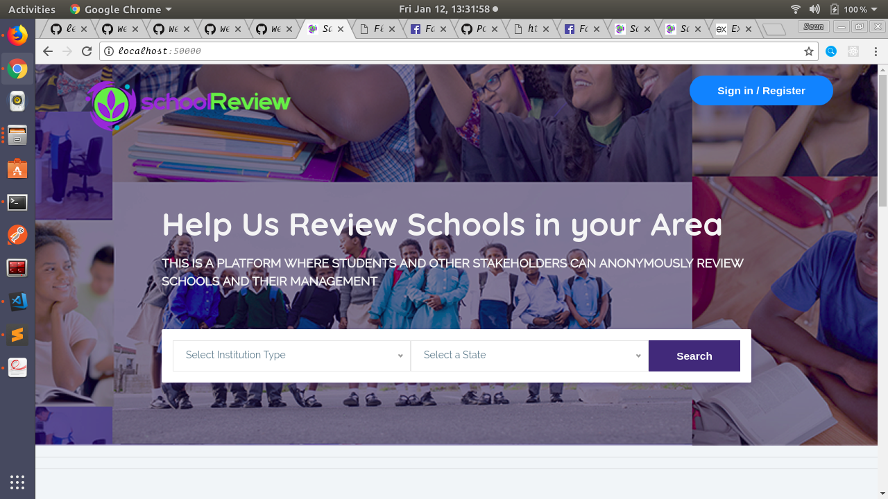

# Sauce Code School Review

### Introduction 
Sauce Code School Review was built during the Sauce Code Hackathon challenge held online by [FindWorka Nigeria](https://findworka.com/)

The app is a platform where students and other stakeholder can anonymously review schools.

### Technologies used
* [NodeJS](https://nodejs.org/) This is a JavaScript runtime built on Chrome's V8 JavaScript engine. It is used for installing and managing the dependencies.
* [React-Native](https://facebook.github.io/react-nativeg) React Native is a library developed by Facebook and this was used to develop the mobile app for the project.
* [nodemailer](https://nodemailer.com) This is an e-mail sending Nodejs module created by Andris Reinman. It is used in parts of the app that involve sending emails (password reset, group notifications)...See how to set up nodemailer [here](https://medium.com/@manojsinghnegi/sending-an-email-using-nodemailer-gmail-7cfa0712a799)
* [Bootstrap 4](https://getbootstrap.com/docs/4.0/getting-started/download/) Bootstrap is a free front-end framework for faster and easier web development. Bootstrap includes HTML and CSS based design templates for typography, forms, buttons, tables, navigation, modals, image carousels and many other, as well as optional JavaScript plugins.
* [Cloudinary](https://cloudinary.com/) We used the clodinary server to host the images uploaded by users.
* [MongoDB - Mlab](https://mlab.com/) mLab is the leading Database-as-a-Service for MongoDB, powering over half a million deployments worldwide
* [Express](https://expressjs.com/) Express is a Fast, unopinionated, minimalist web framework for Node.js
* [Heroku](https://heroku.com/) The demo site of this project has been hosted on Heroku.
### App Features - Screen Shots

Landing Page

### Installation Guide
* Clone the repository 
* Create an Account on Mlab and also create a new database
* Create Clodinary Account
* Create config.js file
* Open config.js file with sample info on config.js.sample
* Start App, From terminal `npm run start` 
* To test App, `npm test`
* Magic happens on port 50000 --- localhost:50000

## Using the App as a guest
* Search for list of schools from the Home Page or navigate to /list to see view all listings
* Select a particular lisiting
* You can now make your review

### Using the App as a user
Create a user account, usually a mail would be sent to you via nodemailer after creating an account. 
As a user, you can:
* Create a new listing
* Edit the listing that you created
* Delete the listing that you created

### User Story
* Users will get email notifications when they sign up.
* Users will get email notifications if their schools have been reviewed.
* Users can reset their passwords.
* Users will get email notifications if they have requested to reset their password.

### Using the App as an admin
Use Postman to create a request POST request to route '/admin007/new' with the username, email and password fields.
As an admin, you can:
* Create a new listing
* Edit the listing that you created
* Delete the listing that you created
* Approve Listings
* Delete / Manage Users

### License
This project is available for use and modification under the MIT License.

### FAQs
Check in the Wiki for the FAQs

### Contributors
* [Seun Daramola](https://seunzone.github.io) --- Freelance Web Developer
* [IB Olamilekan](https://github.com/leksyib) --- Half Stack Web Developer

...Mobile App Coming Soon on another repo.
